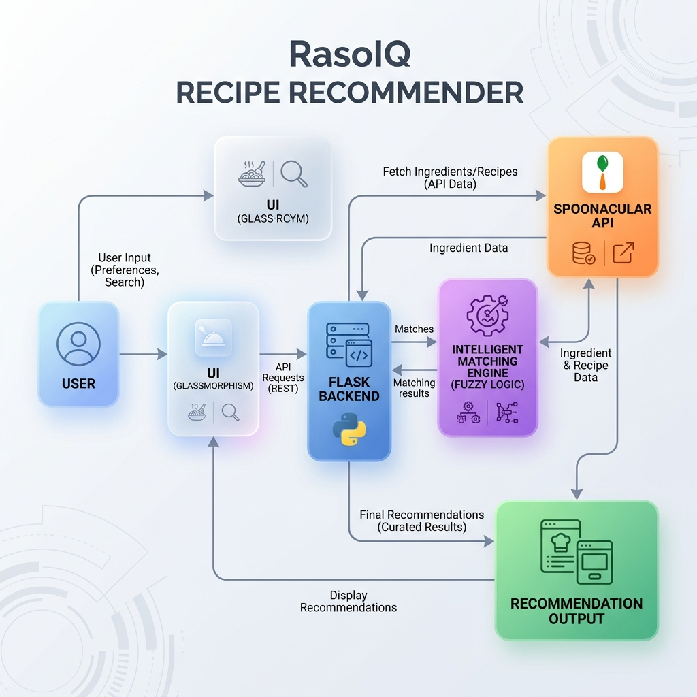

# RasoIQ - Smart Recipe Recommendation System

RasoIQ is an intelligent, ingredient-based recipe recommendation engine built for the **Mumbai University BE Semester 8 Course: Recommendation Systems**.

It uses a weighted intersection-over-union scoring mechanism with specific penalties for missing items and heuristics for staple ingredients.

## 🚀 Features
- **Intelligent Scoring**: Ranks recipes based on ingredient availability.
- **Dietary Filters**: Toggle between Vegetarian and Non-Vegetarian options.
- **Regional Context**: Displays the country/region of origin with flags (e.g., 🇮🇳 India, 🇮🇹 Italy).
- **Staple Handling**: Automatically assumes user has basic items (salt, water, oil) without asking.
- **Premium UI**: Ultra-modern Glassmorphism design with responsive layouts.

## 🏗️ System Architecture



## 🛠️ Tech Stack
- **Frontend**: HTML5, CSS3 (Vanilla + Glassmorphism), JavaScript (Vanilla ES6).
- **Backend**: Python 3.x, Flask, Flask-CORS.
- **Algorithm**: Weighted Set Intersection with Penalty Overlays.

## 📂 Project Structure
```text
RasoIQ/
├── backend/
│   ├── app.py             # Flask API Server
│   ├── recommender.py     # Recommendation Logic
│   ├── requirements.txt   # Dependencies
│   └── data/
│       └── recipes.json   # Knowledge Base (20+ recipes)
├── frontend/
│   ├── index.html         # UI Structure
│   ├── style.css          # Design System
│   └── script.js          # Controller & API Bridge
```

## 🔨 Setup Instructions

### 1. Backend Setup
```bash
cd backend
pip install -r requirements.txt
python app.py
```
*The server will run on `http://127.0.0.1:5000`*

### 2. Frontend Setup
Simply open `frontend/index.html` in any modern web browser (Chrome, Edge, Firefox).

## 🌍 Deployment
- **Backend**: Can be deployed on **Render** or **Railway**.
- **Frontend**: Can be hosted on **Netlify** or **Vercel** (connect the API URL in `script.js`).

## 🎓 Academic Context
- **University**: Mumbai University
- **Year**: 4th Year (BE)
- **Course**: Recommendation Systems
- **Assignment**: Smart Ingredient Matching Engine
