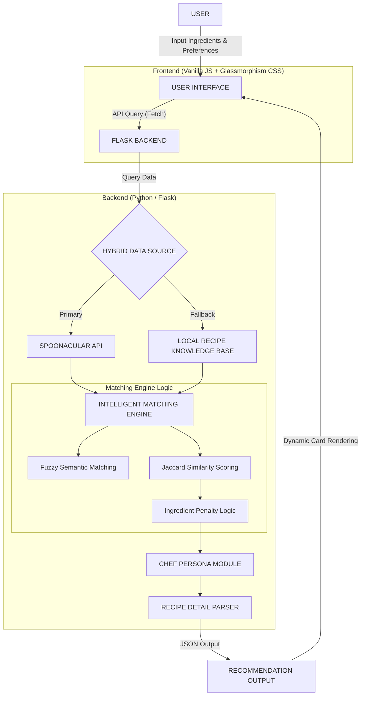

# RasoIQ System Architecture & Workflow

This document provides a technical overview of the RasoIQ Recipe Recommender system, suitable for project reports and academic submissions.

## 🏗️ System Architecture Diagram

## 🔄 Workflow Breakdown

### 1. User Interface (Input Module)
The user provides a list of available ingredients, dietary preferences (Veg/Non-Veg), and cuisine types. The UI uses **Glassmorphism design principles** to provide a premium, modern experience.

### 2. Data Acquisition (Hybrid Strategy)
RasoIQ uses a dual-source strategy:
- **Primary**: Connects to the **Spoonacular Food API** to access 360,000+ recipes and live food photography.
- **Fallback**: Uses a **Local Knowledge Base** (`recipes.json`) if the API limit is reached or the network is unavailable.

### 3. Intelligent Recommendation Engine
Unlike simple keyword matching, RasoIQ uses:
- **Fuzzy Matching**: Handles typos and variations (e.g., "yoghurt" vs "yogurt").
- **Synonym Expansion**: Maps ingredients to their technical counterparts in the database.
- **Similarity Scoring**: Ranks recipes based on the ratio of "Available vs Missing" ingredients using a customized Jaccard metric.

### 4. Detailed Instruction Parsing
The system doesn't just list titles; it fetches detailed metadata including:
- **Staple Detection**: Automatically filters out "staples" (salt, water, oil) from the missing list.
- **Natural Language Instructions**: Parses complex API data into beginner-friendly, step-by-step guides.

### 5. Recommendation Output
Generates high-fidelity recipe cards with:
- **Dynamic Images**: Live gourment photography.
- **Intelligent Explanations**: "Chef's Choice" logic explaining why the recipe was picked.

---

> [!TIP]
> **Technical Highlight**: The system implements an **Industrial-grade Hybrid Recommender** model that balances Live API depth with Local Knowledge reliability.
